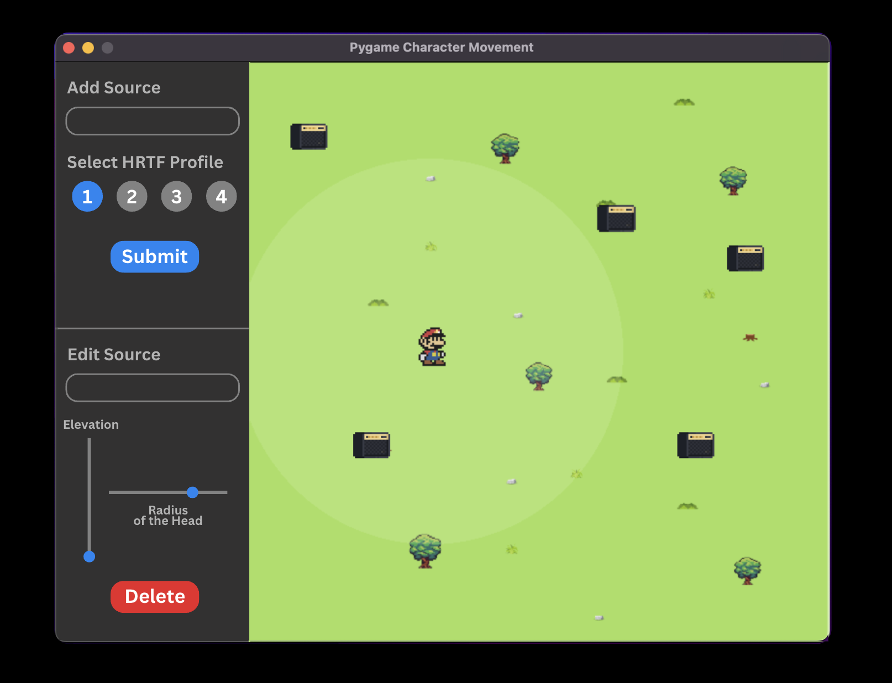
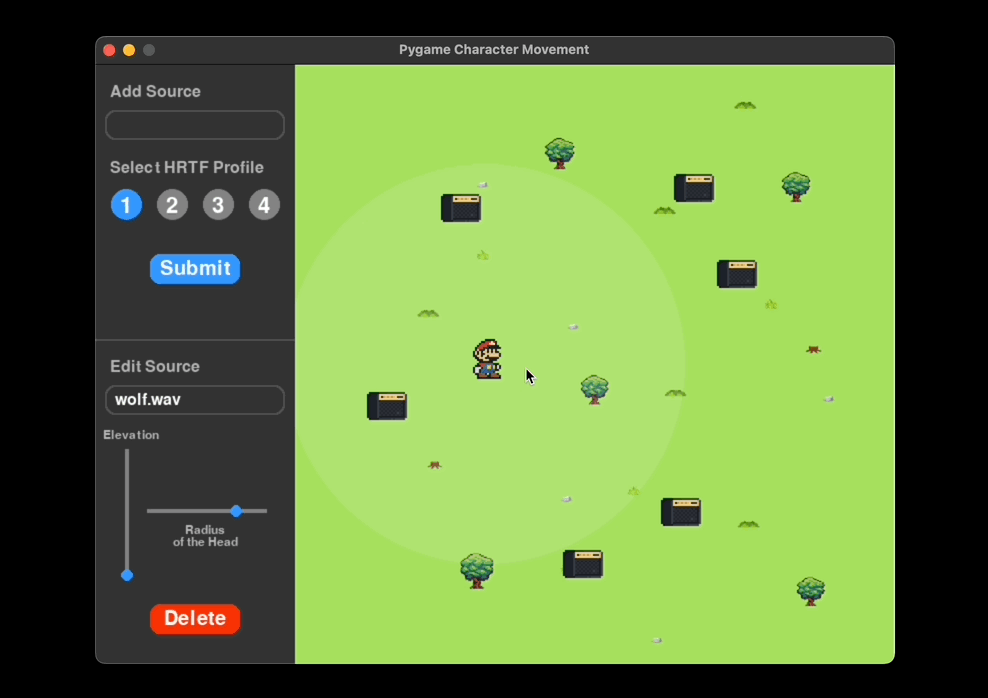

# Table of Contents

1. [3D Audio Playground](#1-3d-audio-playground)
2. [Project Details](#2-project-details)
3. [Installation](#3-installation)
4. [Audio Samples](#4-audio-samples)
5. [Demo](#5-demo)
6. [Optional Parameters](#6-optional-parameters)

## 1. 3D Audio Playground
[3D Audio Playground](https://github.com/Sheel-ui/3d-audio-playground) offers a user-friendly GUI interface that allows users to create and manipulate 3D soundscapes in a simulated environment. The tool's customizable features enable users to control the positioning of sound sources, select from various HRTFs, adjust sound properties like elevation and observe how audio behaves in real-time. 

### Features

- **User-controlled character movement:** Users have complete control over a virtual character and can navigate it in any of the four directions within a 2D plane.

- **Placement of sound sources on a 2D plane:** Users can position sound sources anywhere on the plane according to their preference.

- **Editing Sound Source:** Users can choose any sound source and adjust its elevation using a knob provided in the user interface. Additionally, users have the option to delete placed sound sources.

- **Real-time spatialization of sound:** Changes made to any object in the user interface result in immediate alterations in audio, allowing users to experience real-time spatialization.

- **Choice of HRTF:** Users are presented with four HRTF profiles to select from, enabling them to choose the profile that best suits their ears.

- **Addition of multiple sound sources:** The playground permits users to add multiple sound sources and observe how the spatialized sound varies in real time.

- **Intensity circle:** An intensity circle tracks the movement of the player. The center of this circle corresponds to the player's position, with the intensity of the sound source being maximal at this center point. As the sound source moves away from the circle's center (or the player), the intensity of the sound gradually diminishes, ultimately reaching zero beyond the circle's boundaries.

 
## 2. Project Details

**Usage of HRTFs:**  
The project employs four HRTF profiles and offers the option to select between them.

**Sound quality:**  
We conducted experiments with various combinations of sample rates, bit rates, and chunk sizes to determine the optimal settings for sound output on the tested system (M1 processor). We determined a sample rate of 44,100Hz, a bitrate of 16, and a chunk size of 30,000. Further details about chunk size are provided in Section 6.

**Sound Choice:**  
The project enables users to select their own sound files, while also providing sample animal files for experimentation.

**3D Sound Movement:**  
Users can experience real-time spatialized audio as both the character and sound sources move.

**Design decisions made for perceptual considerations for the user include:**
1. The ability to add multiple sound sources.
2. The option to choose from multiple HRTF profiles.
3. The capability to move sound sources.
4. The ability to import the sound source of choice.


## 3. Installation
To get started with project, follow these steps:

### Clone the repository 
Clone the repository to your local machine.
```bash
$ git clone https://github.com/Sheel-ui/3d-audio-playground.git
```

### Install PortAudio (Only for MacOs) 
1. You need to have brew installed on your system to install portaudio. To install brew, follow official [documentation](https://docs.brew.sh/Installation) or refer this [link](https://stackoverflow.com/questions/66666134/how-to-install-homebrew-on-m1-mac).

2. After installing brew, run below command.
```bash
$ brew install portaudio
```

### Create Environment and Install Depedencies
1. You need to have miniconda installed in your system. Follow offical [documentation](https://docs.anaconda.com/free/miniconda/miniconda-install/) to install miniconda.
2. Create a new conda environment. Install the required dependencies by running the following commands:
```bash
$ conda create -n <env_name> python=3.10.13
$ conda activate <env_name>
$ pip install -r requirements.txt
```

### Run the application
Navigate to the project directory and use following command to run the application
```bash
$ python playground.py
```

## 4. Audio Samples

In this repository, you will find a collection of WAV audio files designed for experiencing spatial audio. These samples are included in the /sample directory.

### Included Samples:

-   *cat.wav*: Audio sample featuring cat sounds.
-   *bird.wav*: Audio sample capturing bird chirps.
-   *lion.wav*: Audio sample of a lion's roar.
-   *wolf.wav*: Audio sample representing wolf howls.
-   *elephant.wav*: Audio sample of elephant's trumpet.
-   *ken.wav*: Audio sample of a song.

### Adding Your Own Audio Files:

To include your own WAV audio file for spatial audio experience:
1.  Ensure your audio file meets the following specifications:
    
    -   Sample rate: 41000 Hz
    -   Channels: Monochannel (1 channel)
    -   Bitrate: 16 bits
2.  Add your WAV audio file to the **/sample** directory of this repository.


## 5. Demo

<div style="text-align: center;">
    
    
</div>


## 6. Optional Parameters

### Creating WAV Files with Specified Specifications

If you don't have a WAV file that meets the specified sample rate, channels, and bitrate, you can create one using the provided convert.py script.

#### Steps to Generate WAV File with Specified Specifications:

1.  Go to the source code of convert.py in this repository.
    
2.  Modify the **input_file** and **output_file** paths in the script to specify the source audio file you want to convert and the destination path for the converted WAV file.
    
3.  Following command will convert the wav file to recommended specifications
```bash
	$ python convert.py
``` 

 This command will run the convert.py script, converting the specified input audio file to a WAV file with the required specifications.
    

  

### Looping Short Audio Files

If you have a very short audio file and you want to loop it multiple times, you can use the provided loop.py script in this repository.

#### Steps to Loop Audio File:

1.  Navigate to the source code of loop.py in this repository.
    
2.  Modify the input_file, output_file paths in the script to specify the path of the input audio file you want to loop and the destination path for the resulting looped audio file. You can alos modify the **loop** parameter to number of times you want to loop the file.
    
3.  Specify the value of n as the number of times you want to loop the audio file.
    
4.  Execute the following command in your terminal:
```bash
	$ python loop.py
``` 
    
 This command will run the loop.py script, looping the specified input audio file the specified number of times and saving the looped audio to the output file path.


### Adjusting CHUNK size

If the sound quality is not as intended, try adjusting the chunk size of the code. You can adjust the chuck size by changing the **CHUNK** variable at *line 12* of **sound.py** file. If the buffer size is too large, smooth movement may be hindered since each buffer is played at a specific azimuth/elevation/radius. Conversely, if the buffer size is too small, your computer may struggle to process the audio rapidly enough.

### Addding you own HRTF profile

The project only supports sofa files. You can add your own HRTF profile by pasting your *.sofa* file in **/hrtf** directory and replace your filename in *line 9* of **setupHRTF.py file**.


